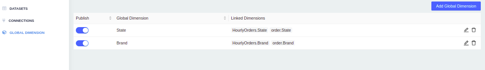

# Overview

.png>)

CueSearch helps you query on your database.

CueSearch results are SQL based tables and charts defined using templates.

CueSearch works with data in your SQL data warehouses and databases. It currently supports Snowflake, BigQuery, Redshift, Druid, Postgres, MySQL, SQL Server and ClickHouse.


### Getting Started

Install via Docker

```
mkdir -p ~/cuebook
wget https://raw.githubusercontent.com/cuebook/CueSearch/main/docker-compose-prod.yml -q -O ~/cuebook/docker-compose-prod.yml
wget https://raw.githubusercontent.com/cuebook/CueSearch/main/.env -q -O ~/cuebook/.env
cd ~/cuebook
docker-compose -f docker-compose-prod.yml --env-file .env up -d
```

Now visit [http://localhost:3000](http://localhost:3000) in your browser.

### How it works

You write a SQL GROUP BY query, map its columns as dimensions and measures, and save it as a virtual Dataset.

.png>)


### Indexing

* Map similar dimension of different datasets in ** `GlobalDimensions`**  screen to merge their search suggestion.



* Non mapped dimension will appear individually in search suggestions.

### Features

* Automated SQL to timeseries transformation.
* Support multiple database.
* Search Results in realtime.
* Template could be written as per requirements.

#### Limitations

* Currently metric as a filter is not available.

### Support

For general help using CueSearch, read the documentation, or go to [Github](https://github.com/cuebook/CueSearch) .

To report a bug or request a feature, open an [issue](https://github.com/cuebook/CueSearch/issues).

### Contributing

We'd love contributions to CueSearch. Before you contribute, please first discuss the change you wish to make via an [issue](https://github.com/cuebook/CueSearch/issues) or a discussion. Contributors are expected to adhere to our [code of conduct](https://github.com/cuebook/cueobserve/blob/main/CODE\_OF\_CONDUCT.md).
